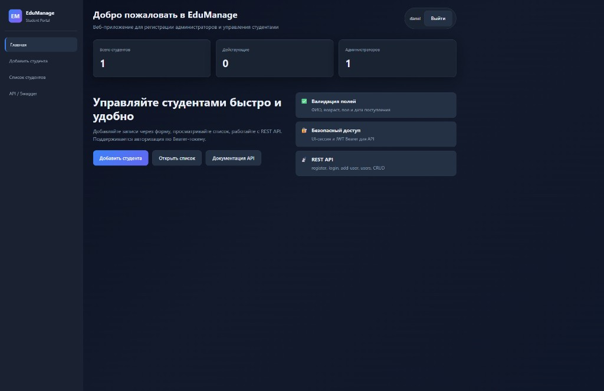
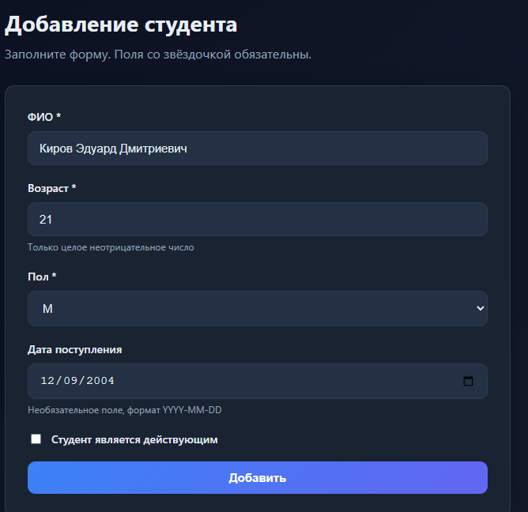
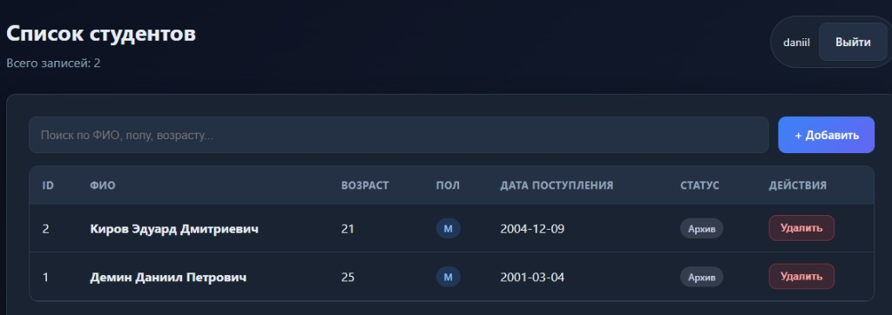
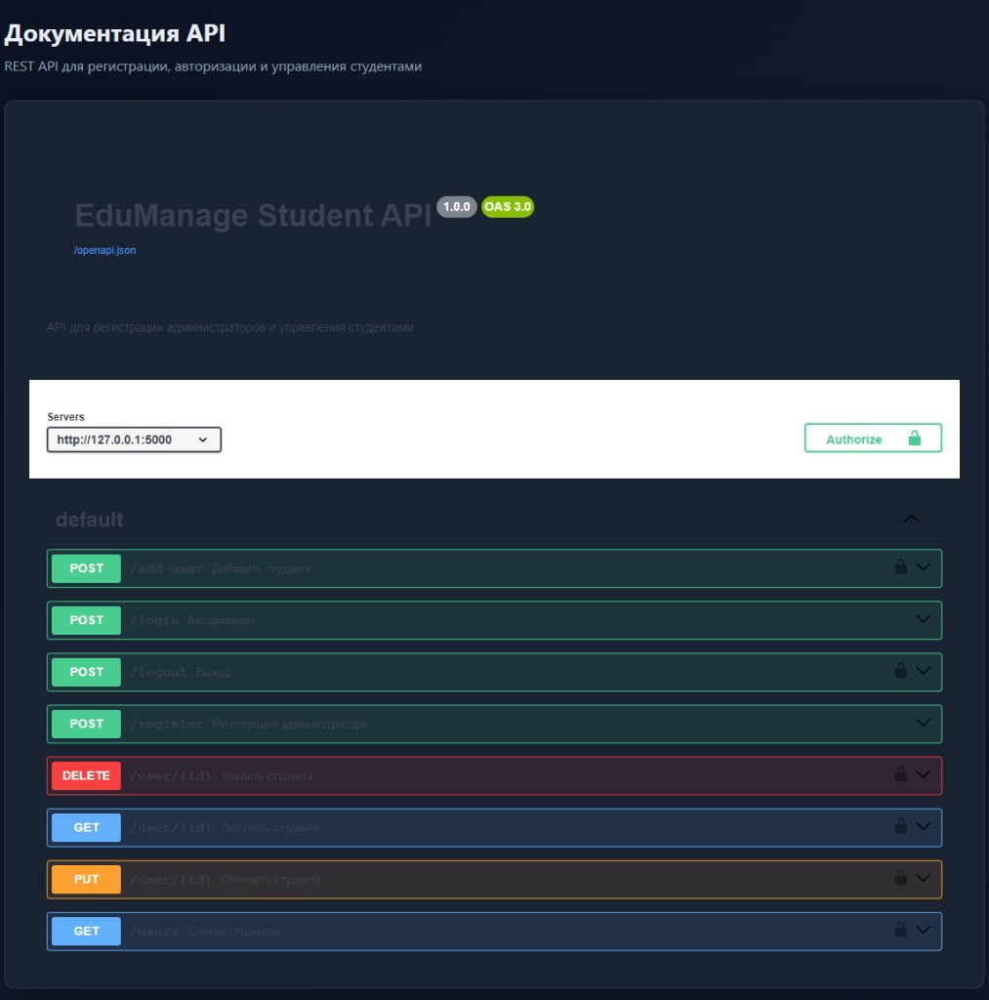
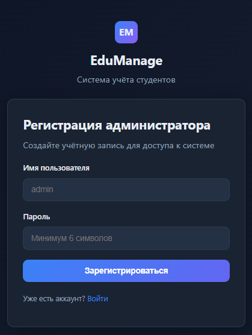
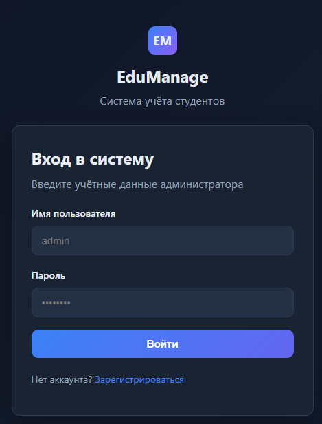
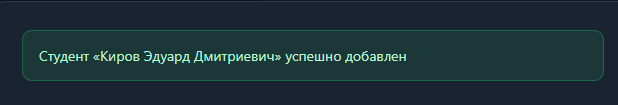

<p align="center">
  
</p>

<h1 align="center">EduManage — автотесты для сервиса управления студентами</h1>

<p align="center">
  Итоговая аттестационная работа по курсу <strong>«Инженер по тестированию: Автоматизация тестирования сервиса с помощью Python»</strong>
</p>

<p align="center">
  <strong>Автор:</strong> Демин Даниил Петрович, группа ИУК4-62Б<br>
  <a href="https://github.com/sun-demon/student-management-tests">github.com/sun-demon/student-management-tests</a>
</p>

Репозиторий содержит автоматизированные UI- и API-тесты, локальную имитацию тестируемого приложения (**EduManage**), интеграцию с TestIt и CI/CD через GitHub Actions.

## Быстрый старт

```bash
git clone https://github.com/sun-demon/student-management-tests.git
cd student-management-tests
python -m venv .venv
source .venv/bin/activate          # Windows: .venv\Scripts\activate
pip install -r requirements.txt

# Запуск приложения в браузере
python mock_server/app.py          # → http://127.0.0.1:5000

# Запуск автотестов (mock-сервер поднимется сам)
pytest tests/
pytest tests/api/                  # только API, без Chrome
```

## Скриншоты приложения

Локальный mock-сервер с современным UI: регистрация, авторизация, CRUD студентов, Swagger.

| Главная | Добавление студента |
|---------|---------------------|
|  |  |

| Список студентов | Swagger API |
|------------------|-------------|
|  |  |

<details>
<summary>Ещё скриншоты (регистрация, вход, успешное добавление)</summary>

| Регистрация | Вход |
|-------------|------|
|  |  |



</details>

## Описание проекта

Тестируемый сервис — веб-приложение для регистрации администраторов и добавления студентов с UI и REST API.

Оригинальный стенд: http://158.160.87.146:5000/

> **Важно:** оригинальный стенд может быть недоступен. В репозитории включён **локальный mock-сервер** (`mock_server/`), который имитирует поведение приложения и позволяет запускать тесты без внешних зависимостей.

### Структура проекта

```
student-management-tests/
├── mock_server/           # Локальная имитация приложения (Flask)
├── docs/
│   ├── icon.svg           # Иконка EduManage для README
│   ├── screenshots/       # Скриншоты UI
│   └── TESTIT_GUIDE.md    # Инструкция по TestIt
├── src/
│   ├── pages/             # Page Object Model для UI
│   ├── utils/             # API-клиент и конфигурация
│   └── test_data/         # Тестовые данные
├── tests/
│   ├── ui/                # Selenium-тесты
│   ├── api/               # API-тесты (Requests)
│   └── conftest.py        # Фикстуры Pytest
├── postman/               # Postman-коллекция
├── .github/workflows/     # GitHub Actions
├── requirements.txt
├── pytest.ini
└── connection_config.ini.example
```

### Реализованные тесты

**UI (Selenium + Page Object):**
- `test_add_student_success` — успешное добавление студента
- `test_add_student_missing_fullname` — отсутствие ФИО
- `test_add_student_invalid_age` — невалидный возраст
- `test_add_student_missing_gender` — отсутствие пола
- `test_add_student_valid_data_special_chars` — ФИО со спецсимволами
- `test_login_success` / `test_login_invalid_password` — авторизация

**API (Requests):**
- Регистрация, авторизация, CRUD студентов
- Негативные сценарии (невалидный возраст, пол, дата)
- Проверка инвалидации токена после logout

### Дополнительные проверки

1. После добавления студента через UI выполняется проверка через API (`GET /users`).
2. Для решения задержки авторизации используются явные ожидания `WebDriverWait` (таймаут 10 с, шаг 0.5 с) и проверка кнопки «Выйти».

## Требования

- Python 3.10+
- Google Chrome (для UI-тестов)
- pip

## Установка

```bash
git clone https://github.com/sun-demon/student-management-tests.git
cd student-management-tests
python -m venv .venv
source .venv/bin/activate   # Windows: .venv\Scripts\activate
pip install -r requirements.txt
```

## Запуск тестов

### Все тесты (mock-сервер стартует автоматически)

```bash
pytest tests/
```

### Только API-тесты

```bash
pytest tests/api/
```

### Только UI-тесты

```bash
pytest tests/ui/
```

### С HTML-отчётом и JUnit XML

```bash
mkdir -p reports
pytest tests/ --html=reports/report.html --self-contained-html --junitxml=reports/results.xml
```

### Запуск mock-сервера вручную

```bash
python mock_server/app.py
# Приложение: http://127.0.0.1:5000
```

### Тестирование против оригинального стенда

Если стенд доступен:

```bash
export BASE_URL=http://158.160.87.146:5000
pytest tests/
```

## Интеграция с TestIt

1. Зарегистрируйтесь на https://id.testit.software/registration
2. Скопируйте `connection_config.ini.example` → `connection_config.ini`
3. Заполните `url`, `privateToken`, `projectId`, `configurationId`
4. Запустите тесты с адаптером:

```bash
pytest tests/ --testit
```

Альтернатива — загрузка JUnit XML через CLI:

```bash
export TMS_TOKEN=<ваш_токен>
testit results import \
  --url https://your-instance.testit.software \
  --project-id <PROJECT_ID> \
  --configuration-id <CONFIGURATION_ID> \
  --testrun-name "Local pytest run" \
  --results reports
```

Документация: https://docs.testit.software/user-guide/integrations/automation/pytest.html

## Postman

Импортируйте коллекцию `postman/Student_Management_API.postman_collection.json`.

**Порядок папок в Collection Runner:**
1. `01 Setup` — Reset, Register, Login
2. `02 Students` — CRUD
3. `03 Negative` — негативные тесты
4. `04 Cleanup` — Logout **только в конце** (иначе token сбросится и Students дадут 401)

У каждого запроса есть вкладка **Tests** — при прогоне отображаются результаты проверок (не «no tests found»).

Переменная `baseUrl`: `http://127.0.0.1:5000` или URL вашего VPS.

## CI/CD (GitHub Actions)

Workflow `.github/workflows/test_run.yml`:
- запуск при push/PR в `main`
- ежедневный запуск по расписанию
- артефакты: JUnit XML и HTML-отчёт

Для отправки результатов в TestIt добавьте secrets в репозиторий:
- `TMS_TOKEN`
- `TMS_URL`
- `TMS_PROJECT_ID`
- `TMS_CONFIGURATION_ID`

## Деплой на VPS (немецкий сервер)

### Вариант 1: Docker (рекомендуется)

На VPS:

```bash
# Скопируйте проект на сервер
scp -r student-management-tests user@YOUR_VPS_IP:/opt/edumanage

# На VPS
cd /opt/edumanage
docker compose up -d --build
```

Приложение будет на `http://YOUR_VPS_IP:5000`

Откройте порт в firewall:
```bash
sudo ufw allow 5000/tcp
```

### Вариант 2: Скрипт

```bash
chmod +x deploy/deploy.sh
sudo APP_DIR=/opt/edumanage ./deploy/deploy.sh
```

### HTTPS + домен

См. `deploy/nginx.conf.example` и Certbot.

Подробнее по TestIT: [docs/TESTIT_GUIDE.md](docs/TESTIT_GUIDE.md)

## Приложения для сдачи

| Файл | Где взять |
|------|-----------|
| `Student_Management_API.postman_collection.json` | `postman/` в репозитории |
| `testit_results.xml` | `reports/results.xml` после `pytest tests/ --junitxml=reports/results.xml` или artifact CI |
| `test_cases_ui.xlsx` | Экспорт из TestIt **или** скриншоты тест-кейсов |
| `test_run_results_ui.xlsx` | Экспорт ручного прогона **или** скриншоты прогона (Lite) |
| Ссылка на GitHub | https://github.com/sun-demon/student-management-tests |

---

| Переменная | По умолчанию | Описание |
|------------|--------------|----------|
| `BASE_URL` | `http://127.0.0.1:5000` | URL тестируемого приложения |
| `HEADLESS` | `true` | Headless-режим браузера |
| `WEBDRIVER_TIMEOUT` | `10` | Таймаут явных ожиданий (сек) |
| `WEBDRIVER_POLL` | `0.5` | Интервал опроса (сек) |

## Примечание о дефектах

В отчёте о тестировании зафиксированы дефекты оригинального приложения (валидация возраста, даты, пола и др.). Локальный mock-сервер реализует **корректную валидацию**, чтобы автотесты стабильно проходили в CI. При тестировании живого стенда часть негативных проверок может выявлять реальные баги.

## Лицензия

Учебный проект. Свободное использование в рамках курса.
